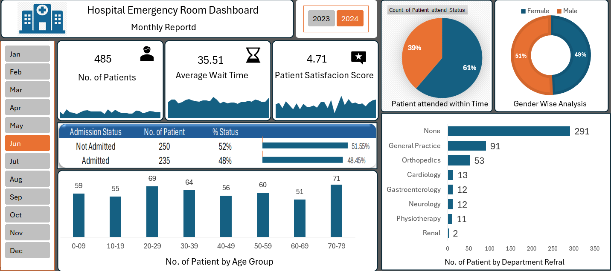

🏥 Hospital Emergency Room Dashboard
📌 Overview

This project is a Hospital Emergency Room Monthly Dashboard designed to analyze patient flow, wait times, admissions, and departmental referrals. The dashboard helps hospital management make data-driven decisions to improve efficiency and patient satisfaction.

📊 Key Insights

Total number of patients per month

Average patient wait time

Patient satisfaction score

Admission vs non-admission analysis

Patients attended within time

Gender-wise distribution

Age group analysis

Department-wise referrals

🛠 Tools & Technologies

Power BI

Data Visualization

Healthcare Analytics

📂 Features

Interactive year and month filters

Clear KPI cards for quick insights

Visual comparison using charts and graphs

User-friendly and clean dashboard design

🎯 Use Case

Ideal for:

Hospital administrators

Healthcare analysts

Operational performance monitoring# Hospital-Emergency-Room-Dashboard

